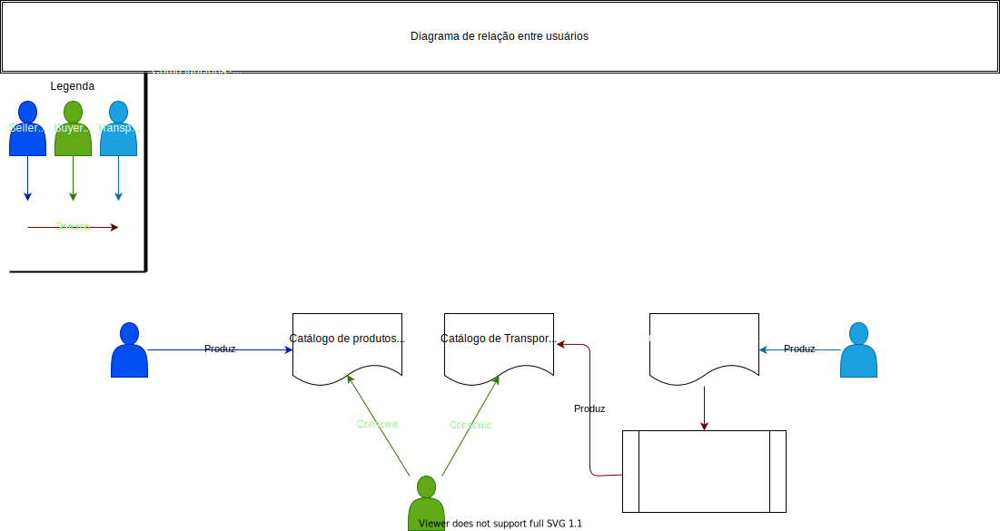

# Best preço backend

## O que é o best preço?

Best preço é um pequeno projeto que estou desenvolvendo apenas para fixar alguns conceitos de DDD e TDD, esta aplicação tem a "intenção" de impactar em 3 frentes diferentes:
1 - Facilitando a aquisição de insumos para microempreendedores individuais (MEI), ou até mesmo algumas micro e pequenas empresas listando os insumos mais baratos da região
2 - Supermercados, atacarejos, enfins podem disponibilizar os insumos que têm e o preço deles assim o microempreendedor pode avaliar se vale mais apena comprar na sua cidade ou região
3 - Loteiros, ou pessoas que estejam de viajem e passem pela cidade da região a fim de buscar os insumos e assim ganahar um dinheiro à mais

Sendo assim, a aplicação tem 3 tipos de usuários:

* Buyer User     - O Usuário que quer comprar os insumos
* Seller User    - O Usuário que quer vender os insunos
* Transport User - O Usuário que fará o transporte dos insumos do Seller User para o Buyer User

Basicamente o Seller User produz um catálogo de produtos e preços que o Buyer User consumirá, ao mesmo tempo que o Transport User alimenta um catálogo de cidades que passará e o preço para o Buyer User também consuma
da seguinte forma:

## O que este projeto terá?

* Testes com jest
* Implementação de geolocalização 
* Outras coisas que serão adicionadas futuramente, mas que no momento ainda não foram analisadas

## O que já está implementado?

* Classes e modelos seguindo (Até onde entendi) os modelos SOLID e de DDD
* Testes unitários dos modelos do domínio
* Uma interface quase REST de implementação do Buyer User em um "banco de dados" em memória (O mais correto seria em tempo de execução)

# FAQ

# Detalhes

1 - Não implementei nenhum sistema de encriptação de senhas ou de login, pois no momento estou focando em desenvolver um domínio robusto, sem contar que isso é um detalhe de implementação, quando a aplicação estiver em um estágio "de homologação" na nuvem com certeza essa implmentação existirá juntamente com um banco de dados de verdade 😉

2 - É importante notar que como é um projeto pessoal e não comercial, o projeto não conta com uma solução *real* do problema, pois esse mesmo modelo levanta diversos desafios que seriam bastante interessante de se resolver, porém necessitariam de além de um investimento inicial um pouco mais de sofisticação na resolução. Para mais detalhes consulte a seção *Desafios enfrentados*

# Como usar?

1 - Clone o repo

2 - Use o seu gerenciador de pacotes para instalar as dependências
  yarn - yarn install
  pnpm - npm install
  ppm  - pnpm install

3 - Use o script de inicialização do seu gerenciador de pacotes
  yarn - yarn start
  pnpm - pnpm start
  npm  - npm start

4 - Acesse o endereço que aparecerá no console e pronto

# Desafios enfrentados

(TODO!)

1 - Pagamentos

A ideia é ótima, mas o que impede um Transport User de simplismente levar a carga de outra pessoa por má fé? E a empresa teria que ter uma pessoa para checar as órdens do Buyer User além de alimentar o catálogo de produtos

Claro que têm como *resolver* esse problema atuando como uma intermediária entre Buyer User x Seller User e Buyer User X Transport User recebendo o pagamento do Buyer User pelo valor da compra e do transporte e liberando eles conforme o recebimento, porém isso também depende de boa fé das pessoas, sem contar que me parece um pouco fora do escopo, embora seja a única opção viável

2 - Devoluções

Caso o Buyer User encontre algo em desacordo com o que ele pediu como, por exemplo, um produto fora da data de validade, como realizar essa devolução, ou antes ainda a conferência. Nada garante que o Buyer User não tenha pego um produto já vencido e dito que foi esse que o Seller User o vendeu.

Uma forma de contornar esse problema é a pessoa encarregada de preparar as órdens do Seller User tire fotos, ou grave um video preparando a órdem, embora simples, essa tentativa de resolver esse problema acaba gerando uma situação de desconfiança entre partes, além de fazer necessário um cloud object storage para lidar com essas fotos/videos e de uma data de validade para essas provas (fotos/videos) para que não fiquem acumuladas de muito tempo atrás

3 - Alimentar Catálogos

As empresas podem não gostar de disponibilizar seu catálogo de produtos tanto por desconfiança quanto por custo, já que algumas empresas tem catálogos gigantescos

Esse problema pode ser resolvido de duas formas e ambas podem inclusive co-exisitir

  1 - Uma integração com o sistema deles, seria basicamente um comando SQL "SELECT preco, nome FROM PRODUTOS" e assim a cada iteração armazenar no catálogo da empresa, uma solução bastante rápida porém pode acabar gerando desconfiança, principalmente em grandes empresas, por mais que possam ver o código, pode ser encarado como software malicioso por algumas empresas

  2 - Uma pessoa alimente esse catálogo por vontade própria. Eu sei pode parecer bastante difícil a primeira vista, porém, não é, e foi justamente por isso que decidi criar o best preço. Já vi muitas pessoas comentando preços da região simplismente por irem lá comprar, ou seja, naturalmente uma pessoa que fosse comprar em algum local pode ter a inciativa de alimentar o catálogo por vontade própria. O problema com essa "resolução" é que a aplicação vai precisar de um novo tipo de usuário e além disso, demoraria muito mais para impactar a vida das pessoas, necessitando principalmente de campanhas de marketing e estratégias que estimulassem esse comportamento o que é financeiramente mais custoso ao projeto.
